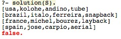

# Resolution of the enigma « The new surf world champion »
:calendar: 2019-2020  

## Introduction
The enigma of __The new surf World champion__ is an enigma made by ourselves. In this enigma, you have to find who is the new surf world champion thanks hints. You have 4 nationalities, 4 first names, 4 last names and 4 figures. Each surfer has of course a first name, a last name, a nationality and he has realized one figure. 

## Enigma of the new surf World champion :
* __Before the Beginning of the competition__

Here comes the final step of surf worldcup competition. Four countries are representated by one surfer.
Who will be the next world champion one year after Mr Ferreira ?
Our bets are on the american surfer ! But let's see, the last worldchampion is still there to defend his title !
Let's go for the competition and let's see ! 

* __After the End of the competition__

Laaaaadies and Gentlemeeeeeeeeen, here is the winner of the competition !! It's useless to say his name, everyone know him now since his awesome Aerial in final !!
Thanks you for your patience and your attention, see you Next year for the 2021 Worldcup competition in the city of the current winner (Which is also the best Erasmus destination) !
Who is the winner of the competition ???
Here are some hints. Good luck !

1. The star player for the USA was a man who realized a tube but his first name wasn’t Michel. 
2. The Brazil’s star player was Italo, who hadn't made a Lay Back.
3. The one who made an Aerial wasn't a french.
4. Michel’s last name wasn’t Andino. 
5. Jose’s last name was Carpio.
6. Kolohe did not do an Aerial.
7. The one who made a Snap Back had a last name of Ferreira but he wasn't spanish.
8. The surfer whose last name was Bourez represented France. 
9. The american wasn’t Jose. 

## Explanation of the code in Prolog :
### First part of the code :
First, we would like to have an answer as in the following way for each surfer : 
[Country, First Name, Last Name, Figure]
And we have 4 surfers, so the solution will be in the following format :

  

Then, we have to do a list of each global attribut in order to regroupe them : for example, we know there is 4 countries : The Usa, Brazil, France and Spain. The we will do a Country List we all of these countries.

  

Here, usa is associated to Country1, brazil to Country2 etc …

As we have associated each country to a fixe variable, we can’t do it with all the other attributs (First Name, Last Name and Figures).

In order to respect that, we have to use the predicate « permuation »

PICTURES

Using that predicate will be useful to change the variable of the associated attribut

PICTURES

In our code, we use that predicate in that way : 

PICTURES

Here, we could think that italo is associated to FName1, kolohe to FName2 etc … But not in reality thanks to the permutation. It will also be useful to use this predicate as we will give « indications » to the variable thanks to the hints of the enigma. 

### Second part of the code :

The second part of the code is the part where we use the hints of the enigma.

To do it, we have to be organised and to find an easy way to do it. Then we have decided to classify each surfer using the following predicate in a precise order : So that the code is clear and understandable. 

PICTURES

Now we just need to use every hint using the precedent predicate :  

PICTURES

Let’s explain what we did and then i twill be easy for the rest of the code.

We know that the surfer is american à member([usa, _, _, _,],S),

We know that this same man realized a tube à member([usa, _, _, tube], S),

We also that his first name wasn’t Michel (Even if it’s a beautiful name PS : Michel c’est le Brésil ) à member(usa, FName1, _, tube],S), Fname1 \= michel,

Thanks « \= », Prolog understand that the first name « FName1 » could not be michel and won’t associate FName1 or michel to the american surfer, or the surfer who realized a tube.

Now, it’s useless to explain the following part of the code because there is nothing more to know, everything is explained before and is in the same format than preceding.

## Solution of the enigma :

Now, as the code is finished, we just have to try it and prolog and we have the following answers : 

PICTURES

To end it, we just have to take back the enigma to answer it :

We know that the one who made an aerial is the new winner.

According to the answers, the spanish sufer Jose Carpio is the new world champion with his awesome Aerial ! Congrats to him. Now, the curious would love to know where will the next world cup be.

Then, they will just have to do some research …

## Bibliography

* [ Prolog library ](https://www.swi-prolog.org/pldoc/man?section=libpl )
* [ Igor's practical part](https://github.com/IgorMy/RC19-20/blob/master/Evaluaci%C3%B3n/Parte%20Pr%C3%A1ctica/README.md)

