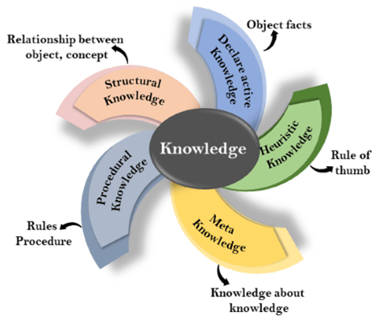
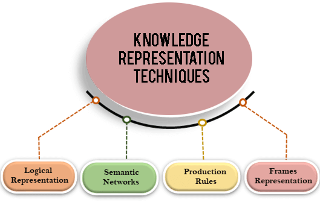
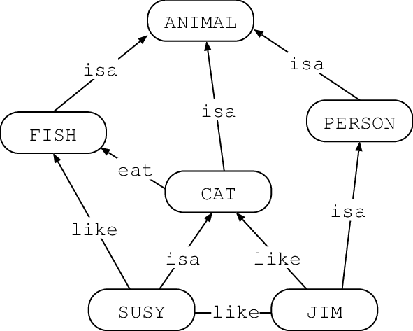
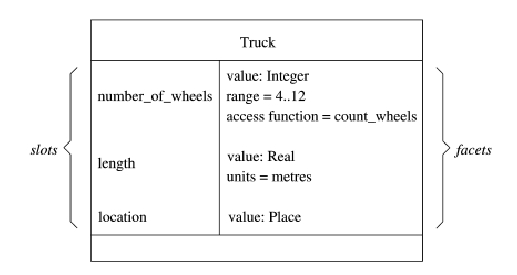

# Knowledge Representation in Artificial Intelligence
:calendar: 2019-2020  

## Introduction
First of all, to talk about Knowledge Representation (KR), we need to agree on what is KR : it is the field of artificial intelligence (AI) dedicated to representing information about the world in a form that a computer system can utilize to solve complex tasks. [1] [2]
But Knowledge is a broad term, different types of knowledge are existing [3][4]  : 
* __Meta Knowledge__ – It’s a knowledge about knowledge and how to gain them.
* __Heuristic Knowledge__ – Representing knowledge of some expert in a field or subject. 
* __Procedural Knowledge__ – Gives information/ knowledge about how to achieve something. 
* __Declarative Knowledge__ – Its about statements that describe a particular object and its attributes , including some behavior in relation with it. 
* __Structural Knowledge__ – Describes what relationship exists between concepts/ objects.

  

## Techniques of Knowledge Representation in AI
There are 4 techniques of knowledge representation [4][5]: 

  

### Logical Representation 
Logical representation is a language with some concrete rules which deals with propositions and has no ambiguity in representation. Logical representation means drawing a conclusion based on various conditions. This representation lays down some important communication rules. It consists of precisely defined syntax and semantics which supports the sound inference. Each sentence can be translated into logics using syntax and semantics. 
* __Syntax__ are the rules which decide how we can construct legal sentences in the logic.
* __Semantics__ are the rules by which we can interpret the sentence in the logic.

### Semantic Networks 
Semantic networks are alternative of predicate logic for knowledge representation. In Semantic networks, we can represent our knowledge in the form of graphical networks. This network consists of nodes representing objects and arcs which describe the relationship between those objects. Semantic networks can categorize the object in different forms and can also link those objects. Semantic networks are easy to understand and can be easily extended. 
This representation consist of mainly two types of relations:
* IS-A relation (Inheritance)
* Kind-of-relation

  

### Production Rules
Production rules system consist of condition/action pairs which mean, "If condition then action". It has three parts:
* The set of production rules
* Working Memory
* The recognize-act-cycle
In __production rules__ it checks for the condition and if the condition exists then production rule fires and corresponding action is carried out. The condition part of the rule determines which rule may be applied to a problem. And the action part carries out the associated problem-solving steps. This complete process is called a __recognize-act cycle__.
The __working memory__ contains the description of the current state of problems-solving and rule can write knowledge to the working memory. This knowledge match and may fire other rules.
If there is a new situation (state) generates, then multiple production rules will be fired together, this is called conflict set. In this situation, the agent needs to select a rule from these sets, and it is called a conflict resolution.

### Frame Representation
A frame is a record like structure which consists of a collection of attributes and its values to describe an entity in the world. Frames are the AI data structure which divides knowledge into substructures by representing stereotypes situations. It consists of a collection of slots and slot values. These slots may be of any type and sizes. Slots have names and values which are called facets. 

  

## Bibliography

* [[1] Knowledge representation's Wikipedia Page : ](https://en.wikipedia.org/wiki/Knowledge\_representation\_and\_reasoning/)
* [[2] Knowledge Representation in AI](http://hdl.handle.net/2142/1300)
* [[3] KR technics in AI](https://www.edureka.co/blog/knowledge-representation-in-ai/)
* [[4] Types of KR](https://learneva.com/blog/types-of-knowledge-in-artificial-intelligence/)
* [[5] Technics of KR](https://www.javatpoint.com/ai-techniques-of-knowledge-representation)
